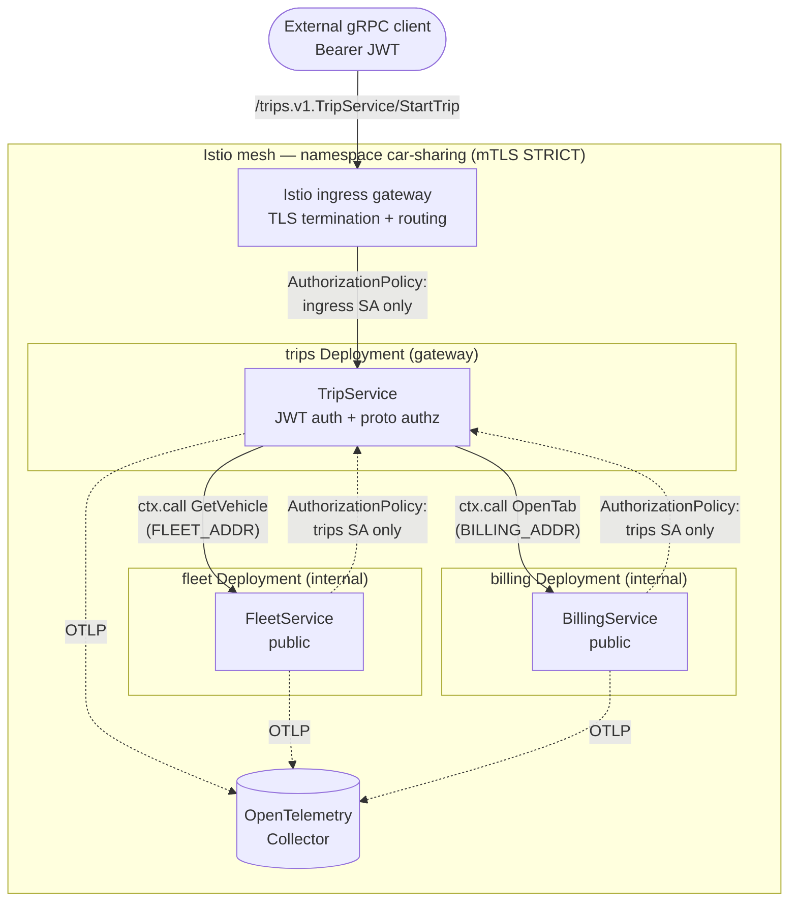

# car-sharing — enterprise deployment on Kubernetes + Istio

A surface-level car-sharing app whose headline is **production deployment**: one
Connectum image runs as three microservices on Kubernetes behind an Istio mesh,
showing three things that are normally hard, wired straight from the framework:

- **Gateway auth at the edge** — JWT authentication + proto-driven authorization
  (`@connectum/auth`) on the public `trips` service.
- **Cross-service `ctx.call` across split pods** — the trip handler calls fleet
  and billing through the typed service catalog; the framework picks in-process
  or network transport from env, no handler changes.
- **OpenTelemetry observability** — RPC tracing/metrics (`@connectum/otel`),
  enabled per role by env, on top of Istio's mesh telemetry.

The product is deliberately shallow. The value is the deployment + framework
wiring.

## Domain

| Service                   | Role            | RPC                          | Auth                                  |
| ------------------------- | --------------- | ---------------------------- | ------------------------------------- |
| `trips.v1.TripService`    | edge / gateway  | `StartTrip(userId, vehicle)` | JWT required (proto `default_policy: allow`) |
| `fleet.v1.FleetService`   | internal leaf   | `GetVehicle(id)`             | `public` (proto `service_auth.public`) |
| `billing.v1.BillingService` | internal leaf | `OpenTab(tripId)`            | `public`                              |

`StartTrip` orchestrates two cross-service calls:

1. `ctx.call("fleet.v1.FleetService/GetVehicle", …)` — unavailable vehicle →
   `FAILED_PRECONDITION`; unknown id → `NOT_FOUND` (propagated from fleet).
2. `ctx.call("billing.v1.BillingService/OpenTab", …)` — opens the tab once the
   trip starts.

## Architecture



### Why `public` on the internal services

A cross-service `ctx.call` re-runs the **full server interceptor chain** (in
monolith and split mode alike) but carries **no inbound `Authorization` header** —
Connectum does not auto-propagate request headers across `ctx.call`. If fleet and
billing required JWT auth, the trip handler's internal calls would be rejected as
`UNAUTHENTICATED` by the very chain that protects the edge.

So fleet and billing are marked `public` in proto (`service_auth { public: true }`),
which skips authn + authz for them. The real trust boundary is the **mesh**:
Istio `PeerAuthentication` (mTLS STRICT) + `AuthorizationPolicy` admit fleet/billing
traffic only from the `trips` ServiceAccount. The gateway authenticates external
clients; the mesh guarantees internal services are reachable solely by the gateway.

### One image, role by env

The same image is the monolith and every microservice role; `SERVICES` selects
what each process mounts locally, and `*_ADDR` env vars tell `ctx.call` where the
remote peers live:

| Role     | `SERVICES`                  | Remote endpoints                |
| -------- | --------------------------- | ------------------------------- |
| monolith | unset / `*`                 | none (all in-process)           |
| trips    | `trips.v1.TripService`      | `FLEET_ADDR`, `BILLING_ADDR`    |
| fleet    | `fleet.v1.FleetService`     | none (leaf)                     |
| billing  | `billing.v1.BillingService` | none (leaf)                     |

See `src/topology.ts` (env → `enabledServices` + `perServiceEnvResolver`).

## Run locally (monolith)

```bash
# Install (published @connectum/* versions) and generate proto code.
pnpm install
pnpm buf:generate     # gen/ — message types + catalog.gen.ts (ctx.call typing)
pnpm typecheck
pnpm test             # in-process e2e: gateway auth, ctx.call, error paths
pnpm start            # monolith on :5000 (SERVICES unset)
```

The e2e suite (`tests/e2e/e2e.test.ts`) runs the whole app in one process and
asserts: the happy `StartTrip` path (both `ctx.call`s), `FAILED_PRECONDITION` for
an unavailable vehicle, `NOT_FOUND` propagated from fleet, and the gateway
rejecting unauthenticated / invalid-token requests while the public fleet service
is reachable without a token.

### `ctx.call` error propagation

When a `ctx.call` to an internal service throws (e.g. fleet's `NOT_FOUND`), the
`ConnectError` travels back through the trip handler and out to the external
gRPC client with its `Code` intact — the e2e asserts exactly this over the gRPC
loopback. The framework strips the in-process transport's framing headers
(`content-length` / `content-type`) from the propagated error, so they never
leak into the outer call's gRPC trailers (which would otherwise be illegal
HTTP/2). No edge-level error translation is needed.

## Build the image

```bash
pnpm buf:generate        # gen/ must exist — it is copied into the image
pnpm run docker:build    # docker build -t car-sharing:local .
```

The Dockerfile is multi-stage and role-agnostic: `node src/index.ts` is the
entrypoint for every role (engines.node `>=25.2.0` runs TypeScript natively).

## Deploy to Kubernetes + Istio

> Config only — these manifests are not exercised by the automated test run; the
> e2e verifies the service code in-process. Adjust the image reference, the TLS
> `credentialName`, and `k8s/secret-jwt.yaml` before applying.

```bash
# 1. Namespace (with Istio sidecar injection) + identities + config.
kubectl apply -f k8s/namespace.yaml
kubectl apply -f k8s/rbac.yaml
kubectl apply -f k8s/secret-jwt.yaml      # replace JWT_SECRET first
kubectl apply -f k8s/configmap.yaml

# 2. Workloads + Services + autoscaling.
kubectl apply -f k8s/deployment-fleet.yaml
kubectl apply -f k8s/deployment-billing.yaml
kubectl apply -f k8s/deployment-trips.yaml
kubectl apply -f k8s/services.yaml
kubectl apply -f k8s/hpa.yaml

# 3. Mesh security + routing.
kubectl apply -f istio/peer-authentication.yaml   # mTLS STRICT
kubectl apply -f istio/authorization-policy.yaml  # fleet/billing <- trips SA only
kubectl apply -f istio/destination-rule.yaml      # pools, outlier detection, subsets
kubectl apply -f istio/virtual-service.yaml       # in-mesh routing + retries
kubectl apply -f istio/gateway.yaml               # external ingress -> trips
```

### What each manifest wires

| File                                | Purpose                                                                 |
| ----------------------------------- | ----------------------------------------------------------------------- |
| `k8s/namespace.yaml`                | namespace + `istio-injection: enabled`                                  |
| `k8s/rbac.yaml`                     | one ServiceAccount per role (identities for AuthorizationPolicy)        |
| `k8s/secret-jwt.yaml`               | `JWT_SECRET` for the gateway (replace before use)                       |
| `k8s/configmap.yaml`                | per-role `SERVICES`, `*_ADDR`, and `OTEL_*` env                         |
| `k8s/deployment-*.yaml`             | Deployment per role (probes, security context, graceful shutdown)       |
| `k8s/services.yaml`                 | ClusterIP Services; their DNS names are the `*_ADDR` targets            |
| `k8s/hpa.yaml`                      | HorizontalPodAutoscaler per role                                        |
| `istio/peer-authentication.yaml`    | mesh-wide mTLS STRICT                                                    |
| `istio/authorization-policy.yaml`   | fleet/billing admit only the trips SA; trips admits only ingress        |
| `istio/destination-rule.yaml`       | connection pools, outlier detection, `stable`/`canary` subsets          |
| `istio/virtual-service.yaml`        | in-mesh routing + retries for `ctx.call` traffic                        |
| `istio/gateway.yaml`                | external ingress Gateway + VirtualService → trips                       |
| `istio/canary-virtual-service.yaml` | 90/10 canary example for the fleet service                              |

### Canary rollout (example)

Deploy a second fleet Deployment whose pods carry `version: canary`, then shift
in-mesh traffic with the weighted route:

```bash
kubectl apply -f istio/canary-virtual-service.yaml   # 90% stable / 10% canary
# adjust weights to progress; re-apply istio/virtual-service.yaml to roll back
```

### Observability

Every role sets `OTEL_EXPORTER_OTLP_ENDPOINT` in its ConfigMap, which turns on the
`@connectum/otel` server interceptor (the app enables OTel only when that env var
is present — see `src/observability.ts`). Spans carry a `connectum.transport`
attribute distinguishing in-process `ctx.call`s from network hops, and
`trustRemote: true` stitches gateway → fleet → billing into one distributed trace.
Point `OTEL_EXPORTER_OTLP_ENDPOINT` at your Collector (the manifests assume
`otel-collector.observability.svc.cluster.local:4317`).

## Layout

```
car-sharing/
├── proto/                      fleet, trips, billing protos (+ auth options import)
├── src/
│   ├── services/               fleetService, billingService, tripService (ctx.call)
│   ├── topology.ts             env → mono/split (SERVICES + perServiceEnvResolver)
│   ├── auth.ts                 JWT + proto authz interceptors (uniform chain)
│   ├── observability.ts        env-gated OpenTelemetry wiring
│   ├── server.ts               buildServer() — services + catalog + interceptors
│   └── index.ts                entry point (role by SERVICES)
├── tests/e2e/e2e.test.ts       monolith, in-process gateway e2e
├── k8s/                        namespace, rbac, secret, configmap, deployments,
│                               services, hpa
├── istio/                      peer-auth, authz, destination-rule, virtual-service,
│                               gateway, canary
├── Dockerfile                  one multi-stage image, role by env
├── buf.yaml / buf.gen.yaml     dual-module (own protos + auth options) + catalog plugin
├── package.json / tsconfig.json / pnpm-workspace.yaml
```
