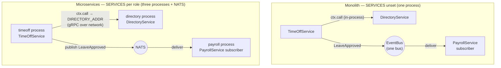

# hris

A shallow **HR Information System** that showcases the hard cases Connectum
solves out of the box: **the same handler code runs as a monolith (in-process)
or as microservices (split processes) purely by env**, plus an event-driven
payroll flow.

Three services and one integration event:

- **`directory.v1.DirectoryService`** — `GetEmployee(id)` → `Employee` (in-memory
  system of record; `Code.NotFound` for an unknown id). A leaf service.
- **`timeoff.v1.TimeOffService`** — `RequestLeave(employeeId, days)`. Its handler
  validates the employee with
  `ctx.call("directory.v1.DirectoryService/GetEmployee", …)`, then approves and
  **publishes** a `LeaveApproved` event.
- **`payroll.v1.PayrollService`** — `GetBalance(employeeId)` → `Balance`.
  **Subscribes** to `LeaveApproved` and decrements the balance.

The product is deliberately thin — the point is the framework wiring.

> **Note:** this example uses the service-catalog API (`defineService`,
> `ctx.call`, `catalog`) and the EventBus, shipped in **1.0.0** (published on
> npm).

## The headline: one codebase, two topologies

`src/server.ts` exposes a single `buildServer()`. It always passes the same three
service definitions and the same generated `serviceCatalog`. Only `src/topology.ts`
reads env and tells the framework what is local vs remote:

- **`SERVICES`** (parsed with `parseServicesEnv` → `enabledServices`) lists the
  proto `typeName`s mounted **locally**. Unset or `*` = **monolith** (all local).
  Set it to one service (`SERVICES=directory.v1.DirectoryService`) and the process
  becomes that single microservice role.
- **`remoteResolver: perServiceEnvResolver(…)`** maps each non-local service to an
  endpoint env var (`DIRECTORY_ADDR`, `TIMEOFF_ADDR`, `PAYROLL_ADDR`), so
  `ctx.call` auto-routes to the right process when it is remote.

Nothing in the service handlers changes between topologies.



In the **monolith** the `ctx.call` dispatches in-process and the publisher and
subscriber share **one bus instance** (TimeOff publishes, Payroll subscribes,
within the same process). In the **split** topology the *same* `ctx.call` goes
over the network via the resolver, and `LeaveApproved` flows broker-to-broker to
the payroll role — without changing a line of handler code.

Both topologies use the **NATS** adapter at runtime (`NATS_URL`), so both need a
NATS broker when started via `pnpm start` / Docker. Only the e2e test swaps in an
in-memory adapter so the full flow runs broker-free (see
[Testing note](#testing-note)).

## Layout

```
proto/
  directory/v1/directory.proto       # DirectoryService.GetEmployee
  timeoff/v1/timeoff.proto           # TimeOffService.RequestLeave
  payroll/v1/payroll.proto           # PayrollService.GetBalance + LeaveApproved + PayrollEventHandlers
  connectum/events/v1/options.proto  # (connectum.events.v1.event).topic option
buf.gen.yaml                         # protoc-gen-es + protoc-gen-connectum-catalog (strategy: all)
src/
  services/directoryService.ts       # leaf service (in-memory)
  services/timeOffService.ts         # ctx.call validation + publishes LeaveApproved
  services/payrollService.ts         # GetBalance + LeaveApproved subscriber route
  topology.ts                        # env → enabledServices + remoteResolver
  eventBus.ts                        # one bus per process; payroll subscribes only when local
  server.ts                          # buildServer() — same code, both topologies
  index.ts                           # env-driven entry point
gen/                                 # generated (buf): *_pb.ts + catalog.gen.ts
tests/e2e/e2e.test.ts                # monolith e2e — in-process, no broker
docker-compose.yml                   # mono + split profiles + NATS (config only)
Dockerfile                           # one image, role chosen by SERVICES env
```

## The generated catalog

`buf generate` runs `protoc-gen-connectum-catalog` (`strategy: all`) to emit
`gen/catalog.gen.ts` with **all** services — including the event-handler service:

```ts
export const serviceCatalog = {
  "directory.v1.DirectoryService": DirectoryService,
  "payroll.v1.PayrollService": PayrollService,
  "payroll.v1.PayrollEventHandlers": PayrollEventHandlers,
  "timeoff.v1.TimeOffService": TimeOffService,
} as const;

declare module "@connectum/core" {
  interface ConnectumCallMap {
    "directory.v1.DirectoryService/GetEmployee": { request: GetEmployeeRequest; response: GetEmployeeResponse };
    "payroll.v1.PayrollService/GetBalance": { request: GetBalanceRequest; response: GetBalanceResponse };
    "payroll.v1.PayrollEventHandlers/OnLeaveApproved": { request: LeaveApproved; response: Empty };
    "timeoff.v1.TimeOffService/RequestLeave": { request: RequestLeaveRequest; response: RequestLeaveResponse };
  }
  interface ConnectumStreamMap {}
}
```

The runtime `serviceCatalog` is passed to `createServer({ catalog })`; the
`declare module` augmentation types every `ctx.call` key. The event-handler entry
(`PayrollEventHandlers`) is mounted via the EventBus, never as an RPC service, so
it is simply never resolved through `ctx.call`.

## Run it

Requires Node.js >= 25.2.0 (native TypeScript) and pnpm >= 10.

```bash
pnpm install

pnpm build:proto   # buf generate → gen/ (incl. catalog.gen.ts with all 3 services)
pnpm typecheck     # ctx.call is typed by the generated catalog
pnpm test          # monolith e2e: ctx.call validation + event-driven balance decrement
```

### Monolith (one process, requires NATS)

`pnpm start` runs everything in one process (`SERVICES` unset). The bus uses the
NATS adapter, so a broker on `NATS_URL` is required at runtime. With Docker:

```bash
docker compose --profile mono up    # mono process + NATS
```

Or directly, against a running NATS broker:

```bash
NATS_URL=nats://localhost:4222 pnpm start   # SERVICES unset → all services local
```

### Microservices (split, requires NATS)

The same image runs each role; cross-service calls auto-route and `LeaveApproved`
flows over NATS. With Docker:

```bash
docker compose --profile split up   # directory + timeoff + payroll + NATS
```

Or run roles directly (a NATS broker on `NATS_URL` is required for the event flow):

```bash
PORT=5001 SERVICES=directory.v1.DirectoryService node src/index.ts
PORT=5002 SERVICES=timeoff.v1.TimeOffService DIRECTORY_ADDR=http://localhost:5001 node src/index.ts
PORT=5003 SERVICES=payroll.v1.PayrollService node src/index.ts
```

## Testing note

The e2e suite (`tests/e2e/e2e.test.ts`) runs the **monolith** with an in-memory
EventBus adapter — no Docker, no NATS. Because the in-memory adapter delivers
synchronously, the `LeaveApproved` event has already decremented the payroll
balance by the time `RequestLeave` resolves, so the assertion needs no polling.
The cross-service validation path (`ctx.call` → `Code.NotFound` for an unknown
employee) needs no broker at all. The split topology shares this exact handler
code and is exercised via `docker-compose.yml`.

## Key points

- **One `buildServer()`, two topologies** — `enabledServices` (from `SERVICES`)
  decides what is mounted locally; `remoteResolver` routes the rest. Handlers are
  identical in both.
- **`ctx.call("<typeName>/<Method>", req)`** — typed by the generated catalog;
  auto-routes in-process vs remote; the inbound deadline/signal cascade.
- **Event-driven across topologies** — TimeOff publishes `LeaveApproved`, Payroll
  subscribes. One bus instance in the monolith, one bus per process in the split
  deployment; both use the NATS adapter at runtime. The e2e swaps in an in-memory
  adapter to run the flow broker-free.
- **`enabledServices: undefined` vs `[]`** — monolith must pass `undefined`
  (mount everything); an empty array would mount nothing. `topology.ts` handles
  the unset/`*` → `undefined` mapping.
