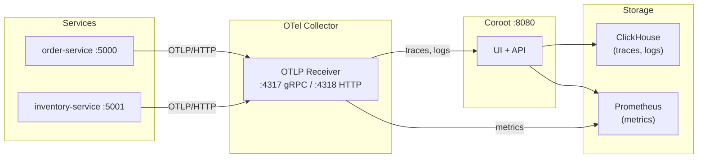

# Observability with Coroot

Full observability stack for Connectum microservices using [Coroot](https://coroot.com/) — an open-source observability platform with automatic service maps, distributed tracing, metrics, and log analysis.

This example extends the [production-ready](../production-ready) example with a complete Coroot-based monitoring stack, demonstrating how `@connectum/otel` telemetry flows from microservices through OpenTelemetry Collector into Coroot dashboards.

## Architecture



### Telemetry Pipeline

| Signal  | Path                                                        |
|---------|-------------------------------------------------------------|
| Traces  | Microservices → OTel Collector → Coroot (OTLP) → ClickHouse |
| Metrics | Microservices → OTel Collector → Prometheus (remote write)  |
| Logs    | Microservices → OTel Collector → Coroot (OTLP) → ClickHouse |

## Prerequisites

- **Docker** and **Docker Compose** v2+
- **~2-4 GB RAM** available (ClickHouse + Coroot + Prometheus)
- **curl** (for traffic generation)

## Quick Start

```bash
# Start the full stack
cd examples/o11y-coroot
docker compose up --build -d

# Wait ~30 seconds for ClickHouse and Coroot to initialize
# Open Coroot UI
open http://localhost:8080
```

## Generating Traffic

After the stack is running, generate RPC traffic so Coroot has telemetry data to display.

### Single requests

```bash
# Create an order
curl -X POST http://localhost:5000/orders.v1.OrderService/CreateOrder \
  -H "Content-Type: application/json" \
  -d '{"items": [{"productId": "widget-1", "quantity": 2}]}'

# Check inventory stock
curl -X POST http://localhost:5001/orders.v1.InventoryService/CheckStock \
  -H "Content-Type: application/json" \
  -d '{"productId": "widget-1", "quantity": 5}'

# Get all orders
curl -X POST http://localhost:5000/orders.v1.OrderService/GetOrders \
  -H "Content-Type: application/json" -d '{}'

# Get full inventory
curl -X POST http://localhost:5001/orders.v1.InventoryService/GetInventory \
  -H "Content-Type: application/json" -d '{}'
```

### Bulk traffic script

Use the included script to generate realistic load across all RPC endpoints:

```bash
# Default: 50 iterations, 0.5s delay
./scripts/generate-traffic.sh

# Custom: 200 iterations, faster requests
DELAY=0.2 ./scripts/generate-traffic.sh 200
```

The script runs health checks, a smoke test, then sends randomized `CreateOrder`, `CheckStock`, `GetInventory`, and `GetOrders` requests with progress output.

## What to Explore in Coroot

After generating traffic, open **http://localhost:8080** and explore:

- **Service Map** — automatic topology of order-service and inventory-service with request rates, latencies, and error rates
- **Traces** — distributed traces for each RPC call with span details and timing breakdown
- **Metrics** — RPC latency histograms, request counts, and resource utilization
- **Logs** — structured logs correlated with traces (click a trace to see associated logs)
- **Inspections** — Coroot's automatic checks for SLO violations, latency anomalies, and error rate spikes

## Services and Ports

| Service             | Port | Protocol          | Description                        |
|---------------------|------|-------------------|------------------------------------|
| Coroot UI           | 8080 | HTTP              | Observability dashboard            |
| order-service       | 5000 | HTTP/2 (Connect)  | Order creation & retrieval         |
| inventory-service   | 5001 | HTTP/2 (Connect)  | Inventory checks                   |
| OTel Collector      | 4317 | gRPC              | OTLP receiver (gRPC)              |
| OTel Collector      | 4318 | HTTP              | OTLP receiver (HTTP)              |
| ClickHouse          | --   | Internal          | Traces & logs storage              |
| Prometheus          | --   | Internal          | Metrics storage                    |

## Files

| File                         | Description                                              |
|------------------------------|----------------------------------------------------------|
| `docker-compose.yml`         | Multi-service orchestration (services + observability)   |
| `otel-collector-config.yaml` | OTel Collector pipelines (traces/metrics/logs routing)   |
| `prometheus.yml`             | Prometheus configuration (remote write receiver)         |
| `clickhouse-users.xml`      | ClickHouse user permissions for Docker network           |
| `scripts/generate-traffic.sh`| Traffic generation script with progress reporting        |
| `service/`                   | Shared microservice source (order + inventory)           |

## Node Agent (Linux Only)

Coroot's node agent provides kernel-level metrics via eBPF (CPU, network, disk I/O per process). It requires a Linux host and does **not** work on Docker Desktop (macOS/Windows).

```bash
# Start with node agent (Linux only)
docker compose --profile node-agent up -d
```

See [coroot/coroot-node-agent#54](https://github.com/coroot/coroot-node-agent/issues/54) for Docker Desktop limitations.

## Troubleshooting

| Problem                            | Solution                                                      |
|------------------------------------|---------------------------------------------------------------|
| Coroot shows no services           | Wait 30-60s after startup; verify OTel Collector is healthy: `docker compose logs otel-collector` |
| Traces not appearing               | Check OTel config routes traces to Coroot: `docker compose logs otel-collector \| grep -i error` |
| ClickHouse won't start             | Check available disk space; ClickHouse needs at least 1 GB free |
| Node agent not working             | Only works on Linux hosts with eBPF; not supported on Docker Desktop |
| Services unhealthy                 | Check service logs: `docker compose logs order-service` |
| Port conflicts                     | Ensure ports 5000, 5001, 8080, 4317, 4318 are available      |

## Cleanup

```bash
# Stop all services and remove volumes
docker compose down -v
```

## Technologies

- [Connectum](https://github.com/nicktomlin/connectum) — gRPC/ConnectRPC microservice framework
- [Coroot](https://coroot.com/) — Open-source observability platform
- [OpenTelemetry Collector](https://opentelemetry.io/docs/collector/) — Vendor-agnostic telemetry pipeline
- [ClickHouse](https://clickhouse.com/) — Column-oriented database for traces and logs
- [Prometheus](https://prometheus.io/) — Metrics storage and querying
- [@connectum/otel](../../docs/en/packages/otel.md) — OpenTelemetry instrumentation for Connectum
