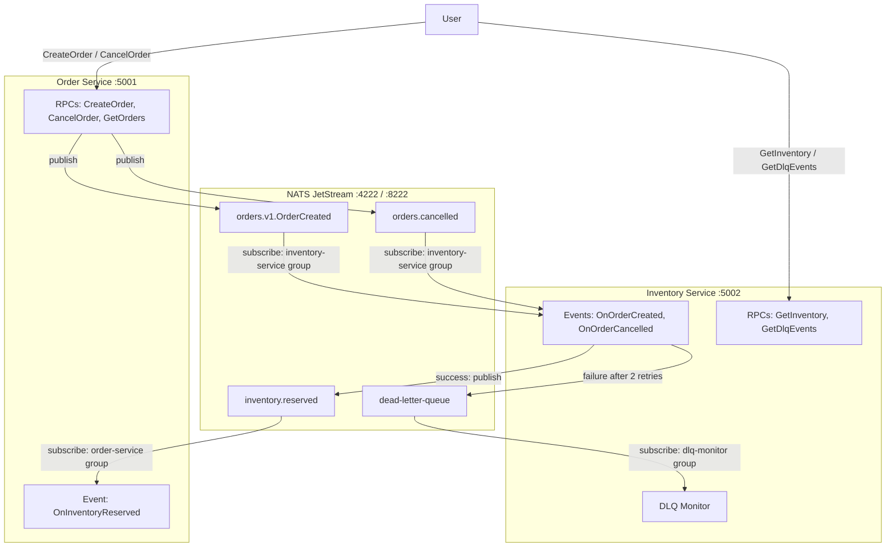
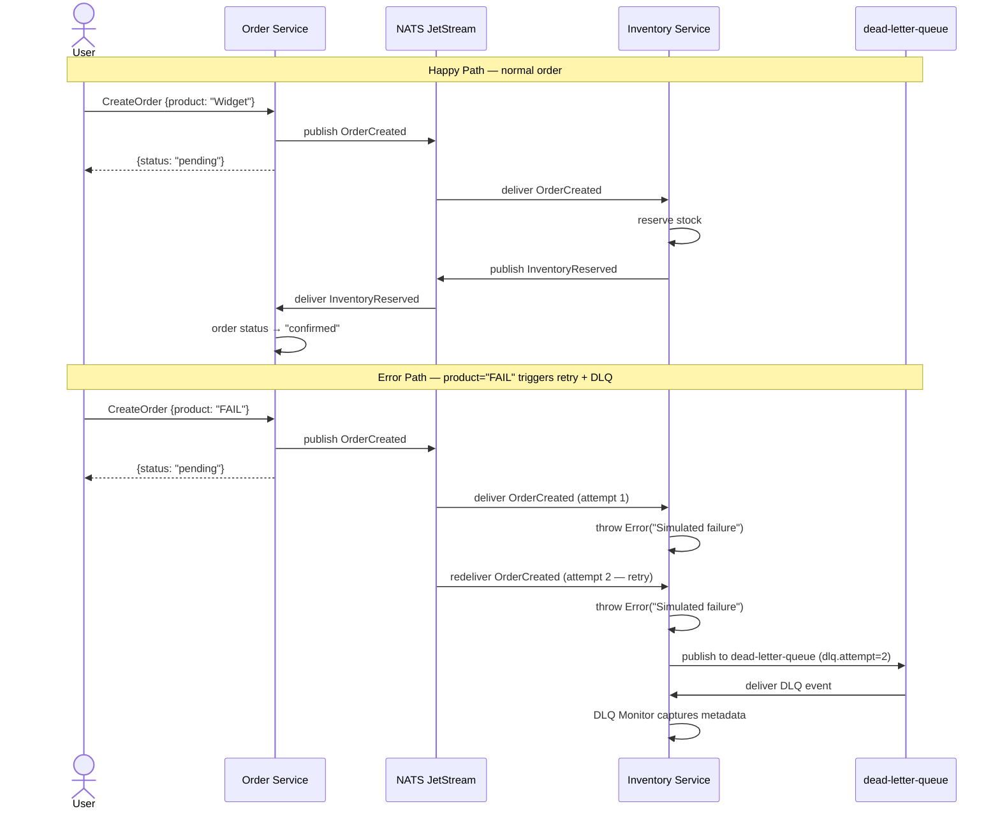

# EventBus + DLQ: Dead Letter Queue with Retry Middleware

An example demonstrating retry and Dead Letter Queue (DLQ) middleware for event-driven microservices using NATS JetStream as the broker. When a handler fails, the middleware retries the event automatically; after all retries are exhausted, the event is routed to a dedicated `dead-letter-queue` topic for inspection and recovery.

## Architecture



## DLQ Flow



## Quick Start

### Prerequisites

- Node.js >= 25.2.0
- Docker + Docker Compose
- pnpm >= 10

### Running

```bash
# 1. Install dependencies
pnpm install

# 2. Generate protobuf code
pnpm run build:proto

# 3. Start NATS JetStream
docker compose up -d nats

# 4. Start microservices (in separate terminals)
NATS_URL=nats://localhost:4222 pnpm run start:order      # port 5001
NATS_URL=nats://localhost:4222 pnpm run start:inventory   # port 5002
```

NATS monitoring dashboard is available at **http://localhost:8222**

### Testing

**Happy path** — normal order flows through the saga and reaches "confirmed":

```bash
# Create a normal order
curl -X POST http://localhost:5001/orders.v1.OrderService/CreateOrder \
  -H "Content-Type: application/json" \
  -d '{"product":"Widget","quantity":5,"customer":"Alice"}'
# → {"orderId":"...","status":"pending"}

# Check status after 2-3 seconds — should be "confirmed"
curl -X POST http://localhost:5001/orders.v1.OrderService/GetOrders \
  -H "Content-Type: application/json" -d '{}'

# Check inventory reservations
curl -X POST http://localhost:5002/orders.v1.InventoryService/GetInventory \
  -H "Content-Type: application/json" -d '{}'
```

**Error path** — product `"FAIL"` causes the handler to throw, triggering 2 retries then DLQ routing:

```bash
# Create a failing order (product="FAIL" simulates a handler error)
curl -X POST http://localhost:5001/orders.v1.OrderService/CreateOrder \
  -H "Content-Type: application/json" \
  -d '{"product":"FAIL","quantity":1,"customer":"Bob"}'
# → {"orderId":"...","status":"pending"}

# After ~1 second: inspect DLQ events captured by the DLQ monitor
curl -X POST http://localhost:5002/orders.v1.InventoryService/GetDlqEvents \
  -H "Content-Type: application/json" -d '{}'
# → {"events":[{"originalTopic":"orders.v1.OrderCreated","originalEventId":"...","error":"Simulated failure for product FAIL","attempt":"2"}]}
```

### Stopping

```bash
docker compose down
```

---

## Project Structure

```
with-events-dlq/
├── proto/
│   ├── connectum/events/v1/options.proto   # Custom topic option
│   └── orders/v1/orders.proto              # Shared proto (includes GetDlqEvents RPC)
├── src/
│   ├── order-service.ts                    # Entrypoint: Order Service (:5001)
│   ├── inventory-service.ts                # Entrypoint: Inventory Service (:5002) + DLQ monitor
│   ├── orderEventBus.ts                    # EventBus config: retry + DLQ middleware
│   ├── inventoryEventBus.ts                # EventBus config: retry + DLQ middleware
│   └── services/
│       ├── orderService.ts                 # CreateOrder, CancelOrder, GetOrders RPCs
│       ├── orderEvents.ts                  # OnInventoryReserved handler
│       ├── inventoryService.ts             # GetInventory, GetDlqEvents RPCs
│       └── inventoryEvents.ts              # OnOrderCreated (with FAIL logic), OnOrderCancelled
├── tests/e2e/events.test.ts                # E2E tests
├── docker-compose.yml                      # NATS JetStream + 2 services
├── Dockerfile                              # Multi-stage build
└── package.json
```

## DLQ & Retry Configuration

Both services share the same middleware configuration — retry with fixed backoff, and DLQ routing to `dead-letter-queue` on final failure:

```typescript
// orderEventBus.ts / inventoryEventBus.ts
export const orderEventBus = createEventBus({
    adapter: NatsAdapter({ servers: NATS_URL, stream: "orders" }),
    routes: [orderEventRoutes],
    group: "order-service",
    middleware: {
        retry: { maxRetries: 2, backoff: "fixed", initialDelay: 200 },
        dlq: { topic: "dead-letter-queue" },
    },
});
```

| Option | Value | Description |
|--------|-------|-------------|
| `retry.maxRetries` | `2` | Maximum number of redelivery attempts before giving up |
| `retry.backoff` | `"fixed"` | Wait the same `initialDelay` between every attempt |
| `retry.initialDelay` | `200` | Milliseconds between retry attempts |
| `dlq.topic` | `"dead-letter-queue"` | Topic where exhausted events are published |

## DLQ Metadata

When an event is routed to the DLQ topic, the middleware attaches diagnostic metadata to the message. The DLQ monitor in Inventory Service reads these keys:

```typescript
// inventory-service.ts — DLQ monitor
inventoryAdapter.subscribe(
    ["dead-letter-queue"],
    async (rawEvent) => {
        dlqEvents.push({
            originalTopic: rawEvent.metadata.get("dlq.original-topic") ?? "unknown",
            originalEventId: rawEvent.metadata.get("dlq.original-id") ?? "unknown",
            error: rawEvent.metadata.get("dlq.error") ?? "unknown",
            attempt: rawEvent.metadata.get("dlq.attempt") ?? "0",
        });
    },
    { group: "dlq-monitor" },
);
```

| Metadata Key | Description |
|--------------|-------------|
| `dlq.original-topic` | Topic the event was originally published to |
| `dlq.original-id` | Unique event ID from the original message |
| `dlq.error` | Error message from the last failed handler invocation |
| `dlq.attempt` | Number of attempts made before routing to DLQ |

## EventBus Configuration

Each microservice creates its own EventBus instance with a separate consumer group and shared NATS stream:

```typescript
// inventoryEventBus.ts
const adapter = NatsAdapter({ servers: NATS_URL, stream: "orders" });

export const inventoryEventBus = createEventBus({
    adapter,
    routes: [inventoryEventRoutes],
    group: "inventory-service",
    middleware: {
        retry: { maxRetries: 2, backoff: "fixed", initialDelay: 200 },
        dlq: { topic: "dead-letter-queue" },
    },
});
```

The `adapter` instance is also exported from `inventoryEventBus.ts` so that `inventory-service.ts` can call `adapter.subscribe()` directly to set up the raw DLQ monitor subscription without going through event routes.

## Docker Compose

```yaml
services:
  nats:                        # NATS JetStream broker
    image: nats:2.11-alpine
    command: ["-js", "-m", "8222"]
    ports:
      - "4222:4222"            # NATS client port
      - "8222:8222"            # HTTP monitoring dashboard

  order-service:               # Order microservice
    ports: ["5001:5001"]
    environment:
      - NATS_URL=nats://nats:4222

  inventory-service:           # Inventory microservice + DLQ monitor
    ports: ["5002:5002"]
    environment:
      - NATS_URL=nats://nats:4222
```

## Technologies

- [Connectum](https://github.com/Connectum-Framework/connectum) — gRPC/ConnectRPC framework
- [NATS](https://nats.io/) — Lightweight cloud-native messaging system
- [NATS JetStream](https://docs.nats.io/nats-concepts/jetstream) — Persistent streaming layer built into NATS
- [@connectum/events](https://github.com/Connectum-Framework/connectum) — EventBus with proto-first routing, retry and DLQ middleware
- [@connectum/events-nats](https://github.com/Connectum-Framework/connectum) — NATS JetStream adapter
