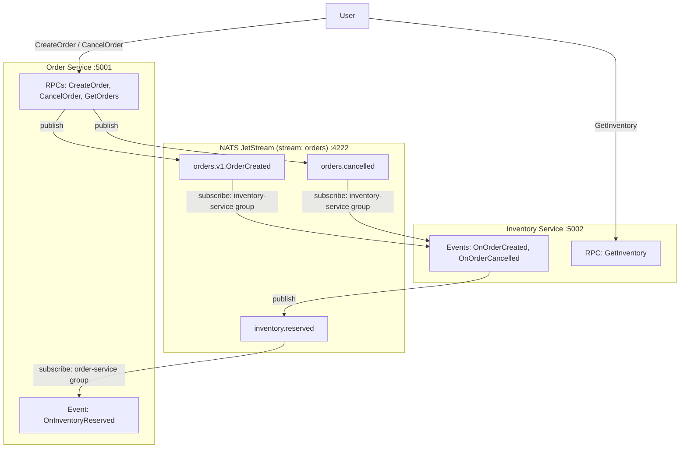
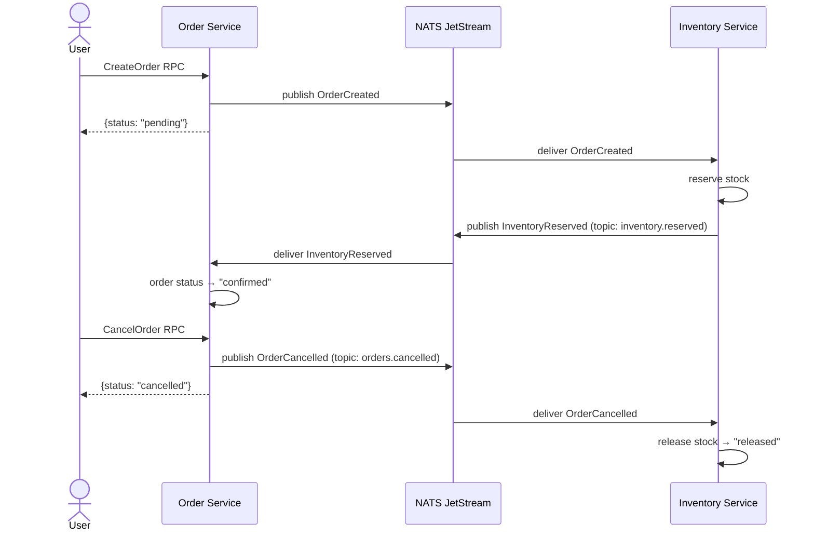

# EventBus + NATS JetStream: 2 Microservices with Saga Pattern

A bidirectional event-driven communication example between microservices using NATS JetStream as the message broker, demonstrating the Saga pattern with proto-first event routing.

## Architecture



### Saga Flow



## Quick Start

### Prerequisites

- Node.js >= 25.2.0
- Docker + Docker Compose
- pnpm >= 10

### Running

```bash
# 1. Install dependencies
pnpm install

# 2. Generate protobuf code
pnpm run build:proto

# 3. Start NATS JetStream
docker compose up -d nats

# 4. Start microservices (in separate terminals)
NATS_URL=nats://localhost:4222 pnpm run start:order      # port 5001
NATS_URL=nats://localhost:4222 pnpm run start:inventory   # port 5002
```

NATS monitoring endpoint is available at **http://localhost:8222**

### Testing

```bash
# Create an order
curl -X POST http://localhost:5001/orders.v1.OrderService/CreateOrder \
  -H "Content-Type: application/json" \
  -d '{"product":"Widget","quantity":5,"customer":"Alice"}'

# Check status (after 2-3 seconds — "confirmed")
curl -X POST http://localhost:5001/orders.v1.OrderService/GetOrders \
  -H "Content-Type: application/json" -d '{}'

# Check reservations
curl -X POST http://localhost:5002/orders.v1.InventoryService/GetInventory \
  -H "Content-Type: application/json" -d '{}'

# Cancel an order
curl -X POST http://localhost:5001/orders.v1.OrderService/CancelOrder \
  -H "Content-Type: application/json" \
  -d '{"orderId":"<ORDER_ID>","reason":"Changed my mind"}'
```

### Stopping

```bash
docker compose down
```

---

## Project Structure

```
with-events-nats/
├── proto/
│   ├── connectum/events/v1/options.proto   # Custom topic option
│   └── orders/v1/orders.proto              # Shared proto definition
├── src/
│   ├── order-service.ts                    # Entrypoint: Order Service (:5001)
│   ├── inventory-service.ts                # Entrypoint: Inventory Service (:5002)
│   ├── orderEventBus.ts                    # EventBus config for Order Service
│   ├── inventoryEventBus.ts                # EventBus config for Inventory Service
│   └── services/
│       ├── orderService.ts                 # CreateOrder, CancelOrder, GetOrders RPCs
│       ├── orderEvents.ts                  # OnInventoryReserved handler
│       ├── inventoryService.ts             # GetInventory RPC
│       └── inventoryEvents.ts              # OnOrderCreated, OnOrderCancelled handlers
├── tests/e2e/events.test.ts                # E2E tests
├── docker-compose.yml                      # NATS + 2 services
├── Dockerfile                              # Multi-stage build
└── package.json
```

## Custom Topics (Proto Options)

Connectum EventBus allows defining custom topic names via the proto option `(connectum.events.v1.event).topic`:

```protobuf
import "connectum/events/v1/options.proto";

service InventoryEventHandlers {
  // Default topic: orders.v1.OrderCreated (from message typeName)
  rpc OnOrderCreated(OrderCreated) returns (google.protobuf.Empty);

  // Custom topic: orders.cancelled
  rpc OnOrderCancelled(OrderCancelled) returns (google.protobuf.Empty) {
    option (connectum.events.v1.event).topic = "orders.cancelled";
  }
}
```

When publishing to a custom topic, specify `topic` in the options:

```typescript
await eventBus.publish(OrderCancelledSchema, data, { topic: "orders.cancelled" });
```

## EventBus Configuration

Each microservice creates its own EventBus instance with a separate consumer group backed by the same NATS JetStream stream `"orders"`:

```typescript
// orderEventBus.ts
export const orderEventBus = createEventBus({
    adapter: NatsAdapter({ servers: NATS_URL, stream: "orders" }),
    routes: [orderEventRoutes],
    group: "order-service",
    middleware: { retry: { maxRetries: 3, backoff: "exponential" } },
});
```

`NatsAdapter` connects to NATS JetStream and uses durable consumers per group, ensuring at-least-once delivery with automatic acknowledgement.

## Docker Compose

```yaml
services:
  nats:                        # NATS JetStream broker
    image: nats:2.11-alpine
    command: ["-js", "-m", "8222"]
    ports: ["4222:4222", "8222:8222"]

  order-service:               # Order microservice
    ports: ["5001:5001"]
    environment:
      - NATS_URL=nats://nats:4222

  inventory-service:           # Inventory microservice
    ports: ["5002:5002"]
    environment:
      - NATS_URL=nats://nats:4222
```

## Technologies

- [Connectum](https://github.com/Connectum-Framework/connectum) — gRPC/ConnectRPC framework
- [NATS JetStream](https://docs.nats.io/nats-concepts/jetstream) — persistent messaging with at-least-once delivery
- [@connectum/events](https://github.com/Connectum-Framework/connectum) — EventBus with proto-first routing
- [@connectum/events-nats](https://github.com/Connectum-Framework/connectum) — NATS JetStream adapter
