# EventBus + Redpanda: 2 Microservices with Saga Pattern

A bidirectional event-driven communication example between microservices using Redpanda (Kafka-compatible broker) with a visual console for monitoring topics and messages.

## Demo

### Architecture Walkthrough

Code structure, proto contracts, EventBus configuration, and saga handlers:

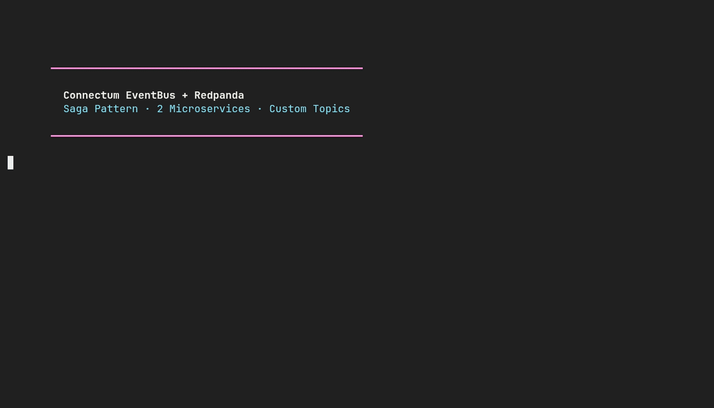

### Live Saga Demo

Creating orders, verifying saga flow, and cancelling with event-driven inventory release:


## Architecture

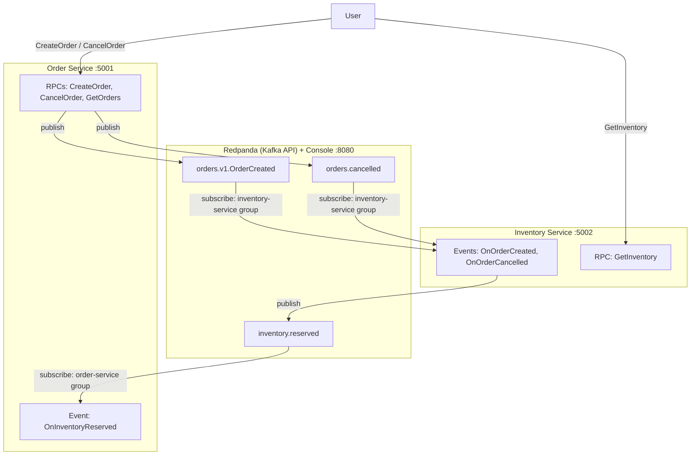

### Saga Flow

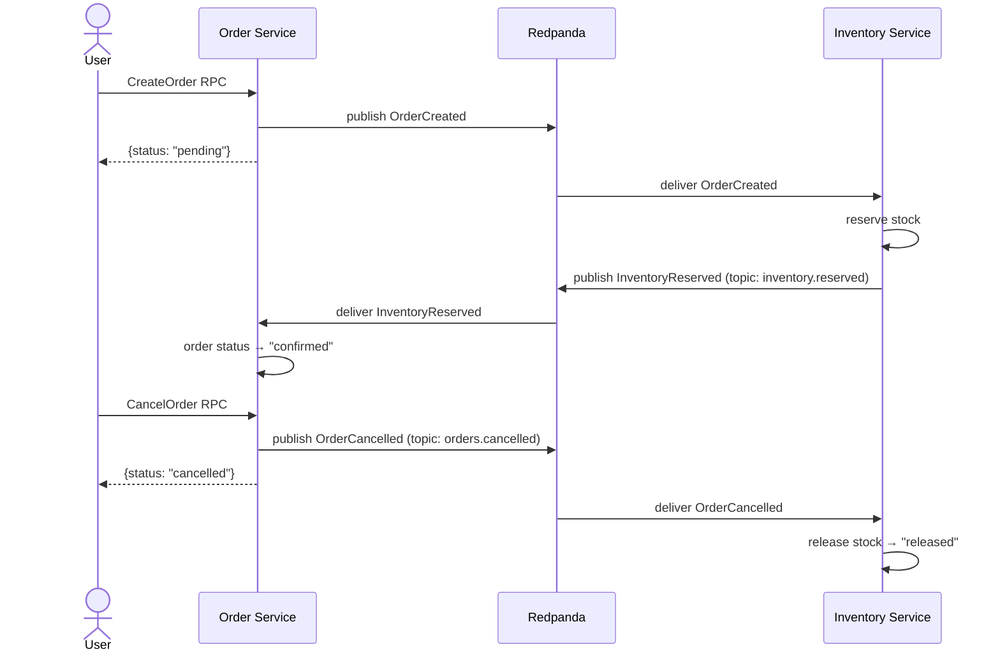

## Quick Start

### Prerequisites

- Node.js >= 25.2.0
- Docker + Docker Compose
- pnpm >= 10

### Running

```bash
# 1. Install dependencies
pnpm install

# 2. Generate protobuf code
pnpm run build:proto

# 3. Start Redpanda + Console
docker compose up -d redpanda console

# 4. Start microservices (in separate terminals)
REDPANDA_BROKERS=localhost:9092 pnpm run start:order      # port 5001
REDPANDA_BROKERS=localhost:9092 pnpm run start:inventory   # port 5002
```

Redpanda Console is available at **http://localhost:8080**

### Testing

```bash
# Create an order
curl -X POST http://localhost:5001/orders.v1.OrderService/CreateOrder \
  -H "Content-Type: application/json" \
  -d '{"product":"Widget","quantity":5,"customer":"Alice"}'

# Check status (after 2-3 seconds — "confirmed")
curl -X POST http://localhost:5001/orders.v1.OrderService/GetOrders \
  -H "Content-Type: application/json" -d '{}'

# Check reservations
curl -X POST http://localhost:5002/orders.v1.InventoryService/GetInventory \
  -H "Content-Type: application/json" -d '{}'

# Cancel an order
curl -X POST http://localhost:5001/orders.v1.OrderService/CancelOrder \
  -H "Content-Type: application/json" \
  -d '{"orderId":"<ORDER_ID>","reason":"Changed my mind"}'
```

### Stopping

```bash
docker compose down
```

---

## Step-by-Step Walkthrough

### Step 1. Redpanda Console — Overview

After running `docker compose up -d`, open http://localhost:8080. The Console shows a single-broker cluster in Running state.

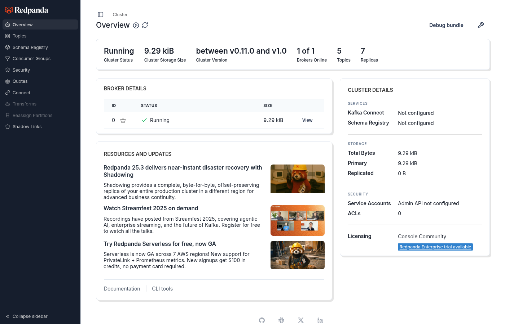

### Step 2. Creating Orders

Send two orders:

```bash
curl -X POST http://localhost:5001/orders.v1.OrderService/CreateOrder \
  -H "Content-Type: application/json" \
  -d '{"product":"Widget","quantity":5,"customer":"Alice"}'
# → {"orderId":"b27ea322-...","status":"pending"}

curl -X POST http://localhost:5001/orders.v1.OrderService/CreateOrder \
  -H "Content-Type: application/json" \
  -d '{"product":"Gadget","quantity":3,"customer":"Bob"}'
# → {"orderId":"a959035d-...","status":"pending"}
```

### Step 3. Topics — All Created Topics

In Redpanda Console under the Topics tab, we can see 4 business topics:

| Topic | Description |
|-------|-------------|
| `orders.v1.OrderCreated` | Default topic (from `schema.typeName`) |
| `orders.cancelled` | Custom topic (proto option) |
| `inventory.reserved` | Custom topic (proto option) |
| `orders.v1.InventoryReserved` | Default topic (published by inventory) |

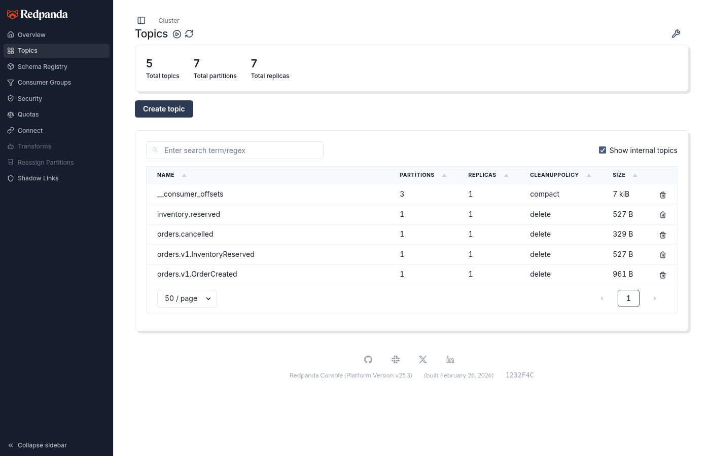

### Step 4. Messages in the OrderCreated Topic

Opening the `orders.v1.OrderCreated` topic reveals 4 messages — protobuf binary payloads containing order UUIDs, products, and customers.

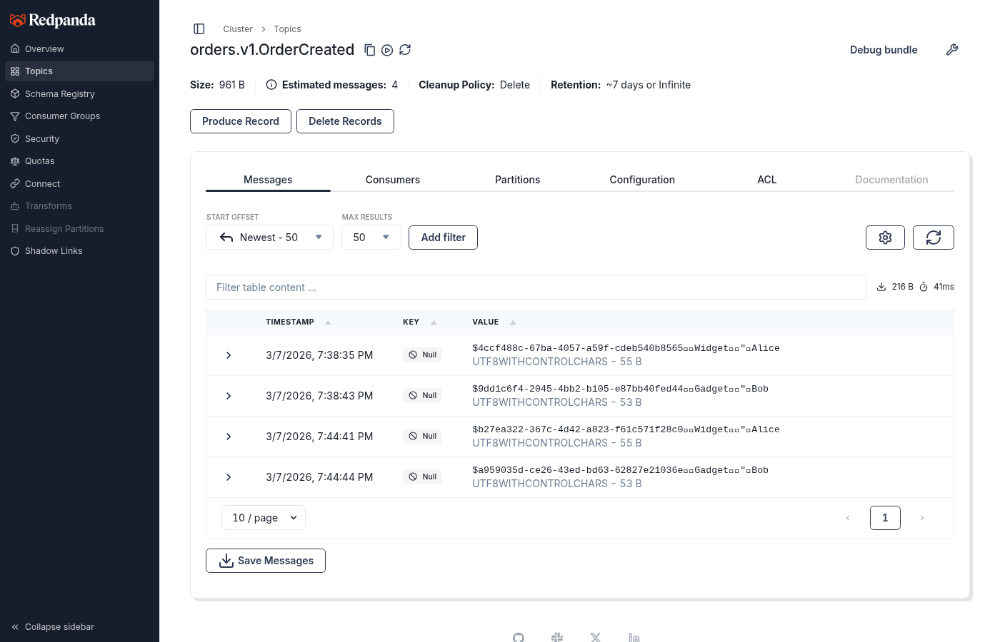

### Step 5. Message Details

Expanding the first message shows:
- **Partition**: 0, **Offset**: 0
- **Value**: 55 B (protobuf binary — orderId, "Widget", quantity=5, "Alice")
- **Headers**: 2 (metadata from KafkaAdapter)

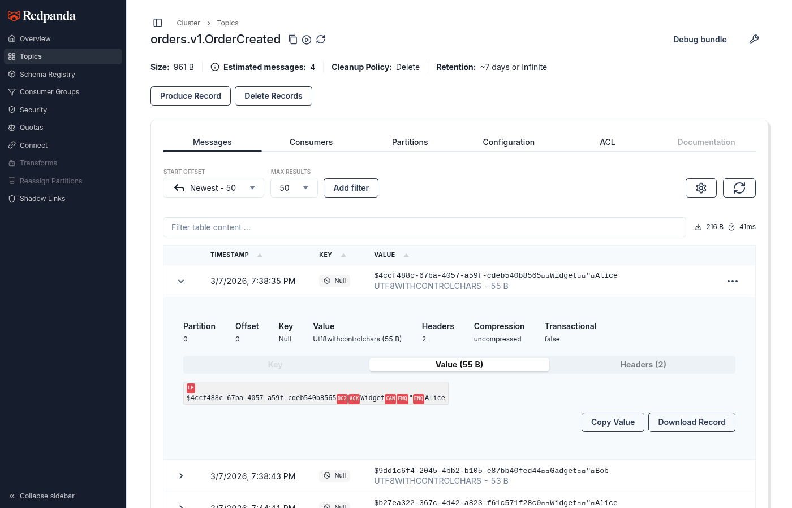

### Step 6. Message Headers

Each message includes service headers added by `KafkaAdapter`:

| Header | Value | Description |
|--------|-------|-------------|
| `x-event-id` | UUID | Unique event identifier |
| `x-published-at` | ISO 8601 | Publish timestamp |

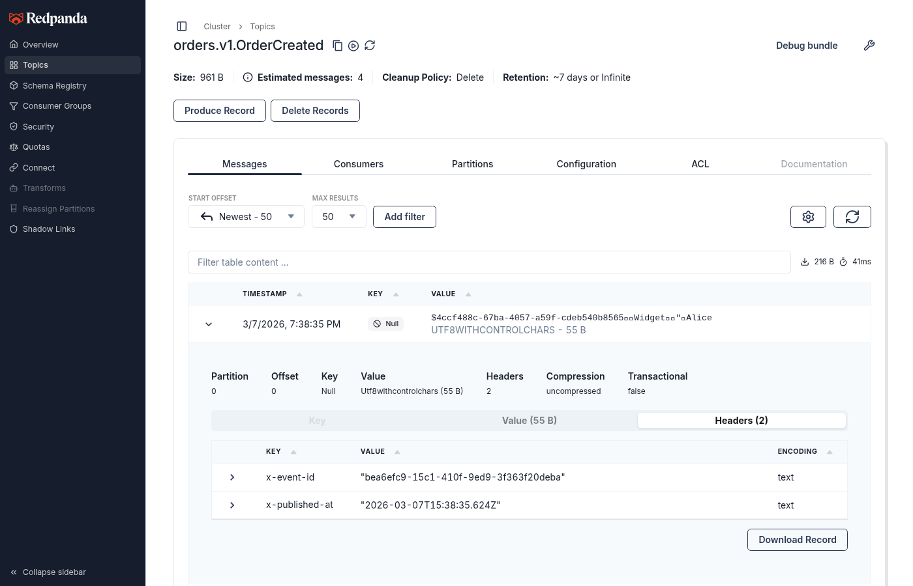

### Step 7. Verifying the Saga — Orders Confirmed

Within 2-3 seconds after creating an order, the saga completes:

```bash
curl -s -X POST http://localhost:5001/orders.v1.OrderService/GetOrders \
  -H "Content-Type: application/json" -d '{}' | jq
```

```json
{
  "orders": [
    { "orderId": "b27ea322-...", "product": "Widget", "quantity": 5, "customer": "Alice", "status": "confirmed" },
    { "orderId": "a959035d-...", "product": "Gadget", "quantity": 3, "customer": "Bob", "status": "confirmed" }
  ]
}
```

### Step 8. The inventory.reserved Topic — Custom Topic

Inventory Service publishes `InventoryReserved` to the custom topic `inventory.reserved` (defined via proto option). Order Service subscribes to this topic and updates the order status to "confirmed".

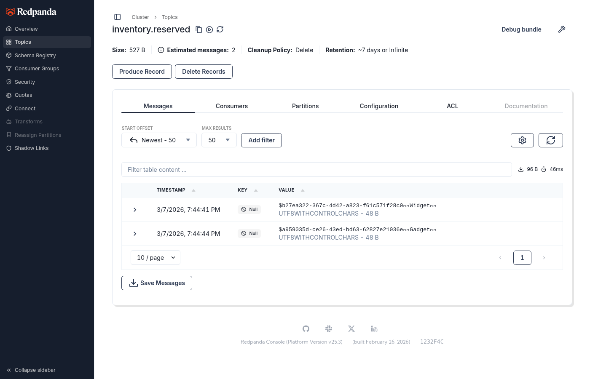

### Step 9. Cancelling an Order

```bash
curl -X POST http://localhost:5001/orders.v1.OrderService/CancelOrder \
  -H "Content-Type: application/json" \
  -d '{"orderId":"b27ea322-...","reason":"Changed my mind"}'
# → {"orderId":"b27ea322-...","status":"cancelled"}
```

### Step 10. The orders.cancelled Topic

Order Service publishes `OrderCancelled` to the custom topic `orders.cancelled`. Inventory Service receives the event and releases the reservation.

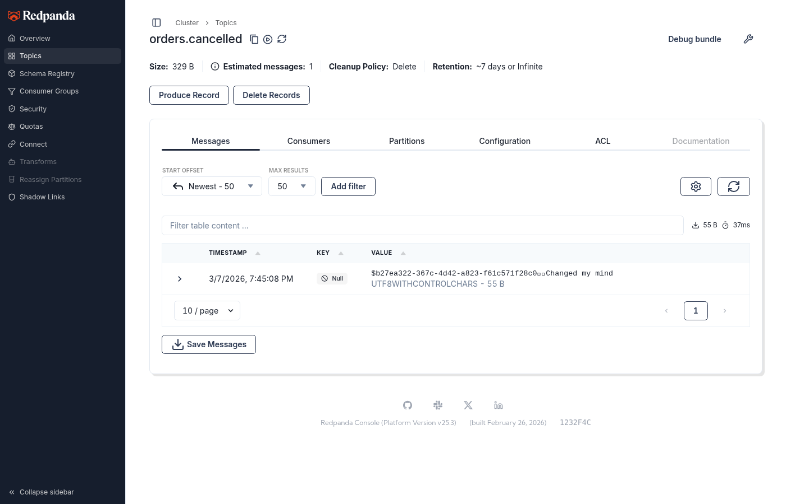

### Step 11. Consumer Groups

The Consumer Groups tab shows 2 groups:

| Group | State | Members | Offset Lag |
|-------|-------|---------|------------|
| `order-service` | Stable | 1 | 0 |
| `inventory-service` | Stable | 1 | 0 |

Offset Lag = 0 means all messages have been processed.

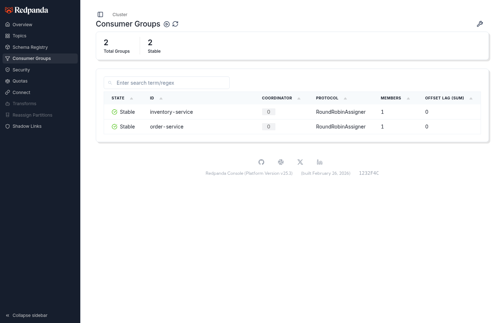

---

## Project Structure

```
with-events-redpanda/
├── proto/
│   ├── connectum/events/v1/options.proto   # Custom topic option
│   └── orders/v1/orders.proto              # Shared proto definition
├── src/
│   ├── order-service.ts                    # Entrypoint: Order Service (:5001)
│   ├── inventory-service.ts                # Entrypoint: Inventory Service (:5002)
│   ├── orderEventBus.ts                    # EventBus config for Order Service
│   ├── inventoryEventBus.ts                # EventBus config for Inventory Service
│   └── services/
│       ├── orderService.ts                 # CreateOrder, CancelOrder, GetOrders RPCs
│       ├── orderEvents.ts                  # OnInventoryReserved handler
│       ├── inventoryService.ts             # GetInventory RPC
│       └── inventoryEvents.ts              # OnOrderCreated, OnOrderCancelled handlers
├── tests/e2e/events.test.ts                # E2E tests
├── console-config.yml                      # Redpanda Console config
├── docker-compose.yml                      # Redpanda + Console + 2 services
├── Dockerfile                              # Multi-stage build
└── package.json
```

## Custom Topics (Proto Options)

Connectum EventBus allows defining custom topic names via the proto option `(connectum.events.v1.event).topic`:

```protobuf
import "connectum/events/v1/options.proto";

service InventoryEventHandlers {
  // Default topic: orders.v1.OrderCreated (from message typeName)
  rpc OnOrderCreated(OrderCreated) returns (google.protobuf.Empty);

  // Custom topic: orders.cancelled
  rpc OnOrderCancelled(OrderCancelled) returns (google.protobuf.Empty) {
    option (connectum.events.v1.event).topic = "orders.cancelled";
  }
}
```

When publishing to a custom topic, specify `topic` in the options:

```typescript
await eventBus.publish(OrderCancelledSchema, data, { topic: "orders.cancelled" });
```

## EventBus Configuration

Each microservice creates its own EventBus instance with a separate consumer group:

```typescript
// orderEventBus.ts
export const orderEventBus = createEventBus({
    adapter: KafkaAdapter({ brokers: REDPANDA_BROKERS, clientId: "order-service" }),
    routes: [orderEventRoutes],
    group: "order-service",
    middleware: { retry: { maxRetries: 3, backoff: "exponential" } },
});
```

Redpanda is fully compatible with the Kafka API, so `@connectum/events-kafka` (`KafkaAdapter`) is used.

## Docker Compose

```yaml
services:
  redpanda:                    # Kafka-compatible broker
    image: redpandadata/redpanda:latest
    ports: ["9092:9092"]

  console:                     # Web UI for monitoring
    image: redpandadata/console:latest
    ports: ["8080:8080"]

  order-service:               # Order microservice
    ports: ["5001:5001"]
    environment:
      - REDPANDA_BROKERS=redpanda:29092

  inventory-service:           # Inventory microservice
    ports: ["5002:5002"]
    environment:
      - REDPANDA_BROKERS=redpanda:29092
```

## Technologies

- [Connectum](https://github.com/Connectum-Framework/connectum) — gRPC/ConnectRPC framework
- [Redpanda](https://redpanda.com/) — Kafka-compatible streaming platform
- [Redpanda Console](https://docs.redpanda.com/current/manage/console/) — Web UI for topics and messages
- [@connectum/events](https://github.com/Connectum-Framework/connectum) — EventBus with proto-first routing
- [@connectum/events-kafka](https://github.com/Connectum-Framework/connectum) — KafkaJS adapter (Kafka + Redpanda)
